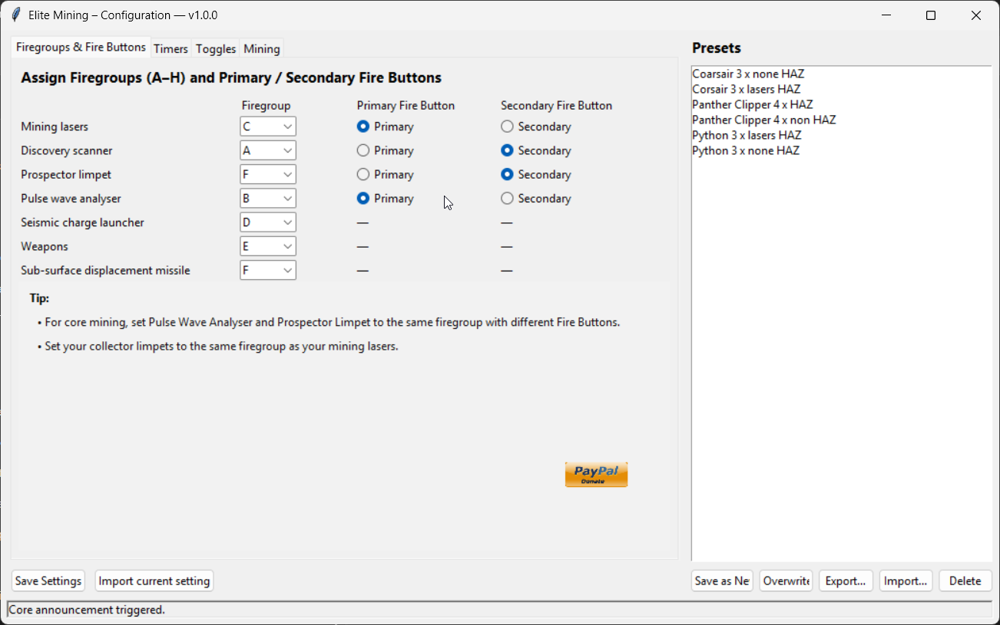
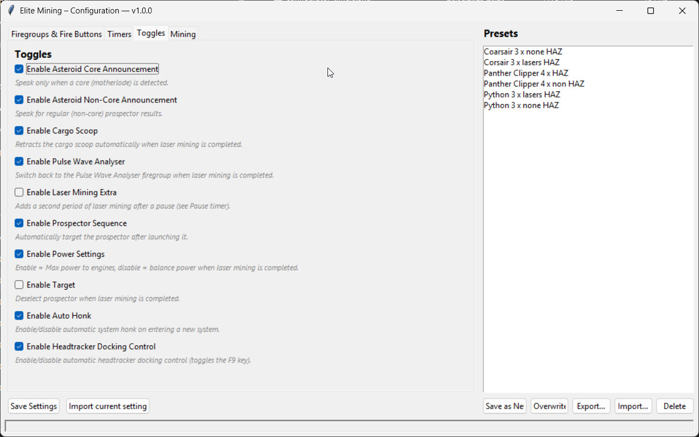
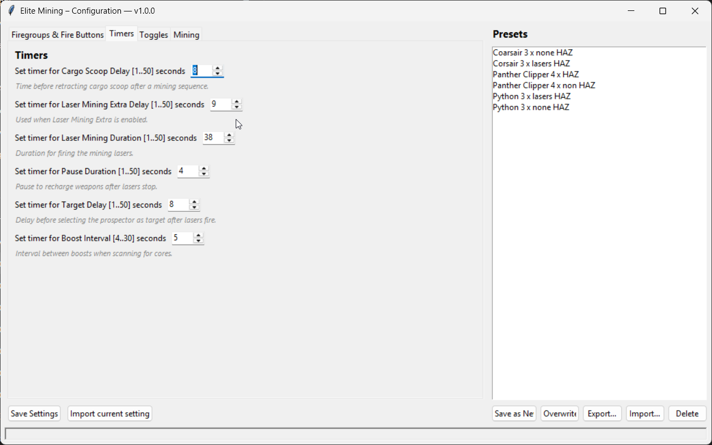
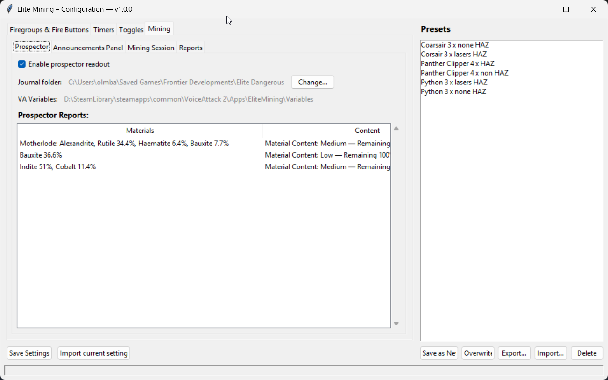
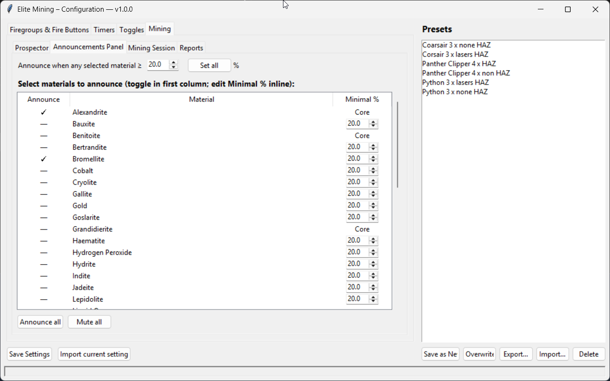
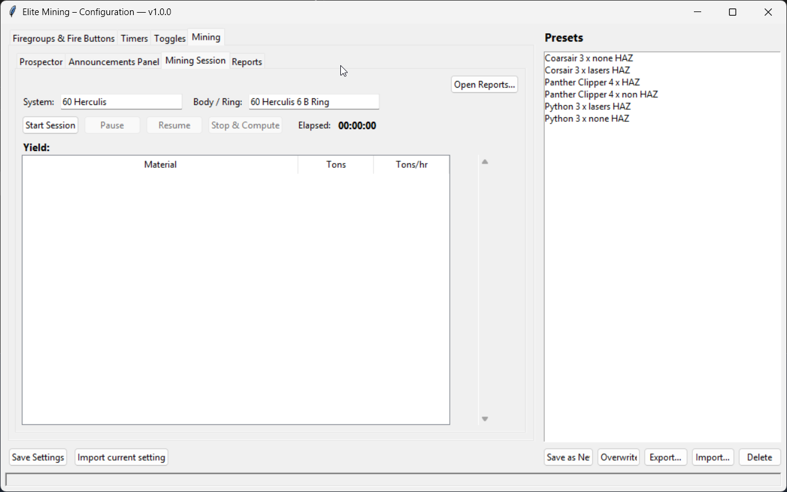
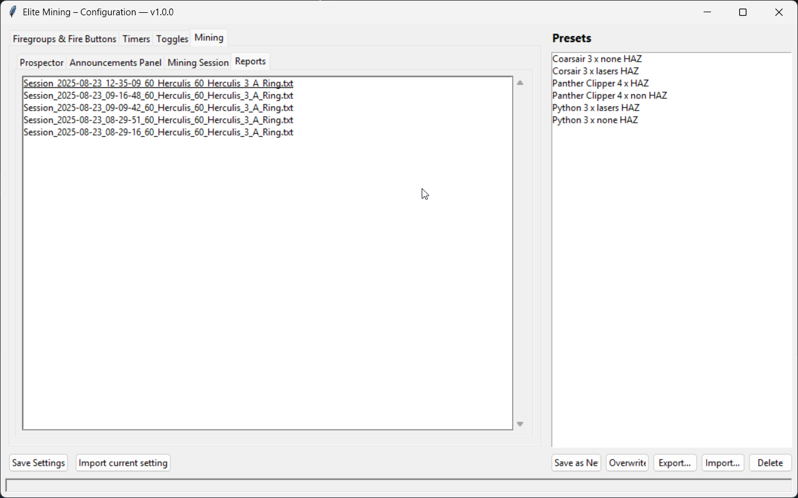

# EliteMining – VoiceAttack Profile for Almost Hands-Free Mining in *Elite Dangerous*

**EliteMining** is a VoiceAttack profile designed to make mining in *Elite Dangerous* smoother, faster, and more immersive — with minimal manual input.

---

📑 Table of Contents

- [Features](#-features)
- [Requirements](#-requirements)
- [Installation](#-installation)
- [Updating](#-updating)
- [Configurator](#️-configurator)
- [Getting Started](#-getting-started)
  - [Firegroup (FG) Setup](#firegroup-fg-setup)
  - [Recommended Key / HOTAS Bindings](#recommended-key--hotas-bindings)
- [Commands](#-commands)
  - [Status Checks](#-status-checks)
  - [Firegroup & Parameter Commands](#-firegroup--parameter-commands)
  - [Miscellaneous](#-miscellaneous)
- [Mining Presets](#-mining-presets)
  - [Hazardous Mining Preset](#hazardous-mining-preset)
  - [Customization](#customization)
- [Usage Tips](#-usage-tips)
- [Known Limitations](#-known-limitations)
- [Training Speech Recognition](#-training-speech-recognition)
- [In Development](#-in-development)
- [Questions / Support](#-questions--support)
- [Disclaimer](#-disclaimer)
- [Credits](#-credits)

---

## ✨ Features
- Custom voice commands to automate mining operations (e.g., deploying limpets, firing mining lasers)
- Customizable ship presets
- Streamlined workflow for efficient mining
- Compatible with [EliteAPI by Somfic](https://docs.somfic.dev/projects/eliteva) for automatic in-game data reading

---

## 📦 Requirements
- **[EliteVA (API) by Somfic](https://docs.somfic.dev/projects/eliteva)**  
- **[VoiceAttack](https://voiceattack.com/)** – Paid version  
- **Working microphone** for voice commands  
- **Elite Dangerous** (PC version)  

---

## ⚙️ Installation
1. Download the latest release from this repository  
2. Extract all contents of the downloaded `.rar` file into your VoiceAttack app folder  
3. Open VoiceAttack → **Profile > Import Profile**  
4. Select **EliteMining-Profile.vap**  

---

## 🔄 Updating
1. Download the `EliteMining.vap` file from the latest release  
2. Replace the existing file in `\VoiceAttack\App\EliteMining`  
3. Update your *Elite Dangerous* keybindings and joystick/HOTAS buttons as needed  

> **Note:** Some updates may require a complete refresh of the installation. In such cases, replace the entire EliteMining directory and re-import the updated EliteMining-Profile.vap into VoiceAttack.

---

## 🖥️ Configurator

The **Configurator** is a standalone tool included with EliteMining. It provides a graphical interface to easily adjust firegroups, toggles, timers, and announcement options without editing VoiceAttack directly.  

### Launching the Configurator
- Say **“Open Configurator”** in VoiceAttack, **or**  
- Press **Right Ctrl + Right Shift + C** on your keyboard.  

### Using the Configurator
1. **Firegroups Tab** – Assign Fire Buttons and Firegroups.  
2. **Toggles Tab** – Enable or disable optional functions.  
3. **Timers Tab** – Configure mining-related timers.  
4. **Mining Tab** – Provides tools for in-game mining operations (Prospector, Announcement Panel, Mining Session, Reports).  

> **Important:** For core / non-core announcements to function properly, ensure that **Secondary Fire** is bound in VoiceAttack for both your keyboard/mouse and your Joystick/HOTAS. In addition, the **Prospector Sequence** toggle in the Configurator must be set to *Enabled* (default = enabled).

---

### 📸 Screenshots  

#### Main Window & Firegroups  
  
*Shows the overall Configurator layout, Firegroups, and Fire Buttons.  
Save, Import, and Preset options are always visible across all tabs.*  

#### Toggles Tab  
  

#### Timers Tab  
  

---

### 🪓 Mining Tab  

The Mining tab provides dedicated tools for in-game mining operations. It contains 4 sub-tabs:  

#### Prospector  
  
*Shows active prospector limpet status and scanned asteroid data.*  

#### Announcement Panel  
  
*Controls material announcements and filtering of core vs non-core finds.*  

#### Mining Session  
  
*Tracks current mining session time, materials collected, and progress.*  

#### Reports  
  
*Provides detailed mining statistics and session summaries.*  

---

## 🚀 Getting Started

### Firegroup (FG) Setup
| Component | FG | Fire Button | Notes |
|-----------|----|-------------|-------|
| Discovery Scanner | Set by command or presets | Secondary | – |
| Surface Scanner | A | Primary | – |
| Mining Lasers | Set by command or presets | Primary | – |
| Collector Limpet Controller | Set by command or presets | Same as Mining Lasers (and SSDM) | Must be set manually |
| Pulse Wave Analyser | Set by command or presets | Primary | – |
| Sub-surface Displacement Missile (SSDM) | Set by command or presets | Primary | – |
| Prospector Limpet Controller | Same as Pulse Wave Analyser (recommended) | Secondary | Must be set manually |

⚠️ **Important:** Collector & Prospector Limpet Controllers **must be set manually**.

---

### Recommended Key / HOTAS Bindings
| Action | Description |
|--------|-------------|
| Stop profiles command | Stopping all running commands inside this profile.. |
| Start Mining | Starts laser mining sequence |
| Reset Mining | Stops/resets mining sequence |
| Deploy Seismic Charge Launcher | Switch FG to Seismic Charge Launcher |
| Deploy Weapons | Switch FG to weapons |
| Start Scanning for Cores | Starts scanning sequence (FG set, continuous boost + pulsewave) |
| Stop Scanning for Cores | Stops scanning sequence |
| Clear and Jump | Clears mass lock & activates Supercruise/FSD jump |
| TrackIR Integration | Set pause toggle in TrackIR software to **F9** |

---

## 🎙️ Commands

### ✅ Status Checks
| Spoken Command | Description |
|----------------|-------------|
| "Say firegroup for weapons" | Reports FG for weapons |
| "Say firegroup for mining lasers" | Reports FG for mining lasers |
| "Say firegroup for Sub-surface Displacement Missile" | Reports FG for SSDMs |
| "Say firegroup for Pulse Wave Analyser" | Reports FG for PWA |
| "Say toggle for cargo scoop / power / mining / etc." | Reports toggle status |
| "Say timer for laser mining / target / pause" | Reports active timer values |

---

### 🔧 Firegroup & Parameter Commands
| Spoken Command | Description |
|----------------|-------------|
| "Set firegroup for Discovery Scanner to [A–H]" | Assigns Discovery Scanner |
| "Set firegroup for mining lasers to [A–H]" | Assigns Mining Lasers |
| "Set firegroup for Pulse Wave Analyser to [A–H]" | Assigns PWA |
| "Set firegroup for Seismic Charge Launcher to [A–H]" | Assigns Seismic Charge Launcher |
| "Set firegroup for Sub-surface Displacement Missile to [A–H]" | Assigns SSDM |
| "Set firegroup for weapons to [A–H]" | Assigns weapons |

Additional categories:
- **Commands – Set Firegroups (FG)**  
- **Commands – Set Timers**  
- **Commands – Set Toggles**  
- **Commands – Check – Status**  

---

### 🎮 Miscellaneous
| Spoken Command | Description |
|----------------|-------------|
| "Landing Request" | Requests docking + extends landing gear after 5s |
| "Enable/Disable Autohonk" | Toggles auto-discovery scan after jump (enabled by default) |

---

## ⚡ Mining Presets

### Hazardous Mining Preset
- **Command:** `"Set mining configuration for 3 x haz"`  
- **Configuration includes:**
  - Firegroups set for all mining tools  
  - Timers optimized for laser mining  
  - Toggles adjusted for power management  

### Customization
- Add new presets for different ships  
- Adjust firegroups, timers, and toggles on-the-fly  
- Modify via built-in commands  

---

## 💡 Usage Tips
- **Short press** → Starts command  
- **Long press** → Stops/resets command  

Enable **"Shortcut is invoked when long-pressed"** in VoiceAttack.

**Best practice:**
1. Set fire buttons & FGs  
2. Select a ship preset  
3. Begin mining and practice commands  

---

## 🚧 In Development
- Option to select and swap primary or secondary fire buttons  (In place with release of v 3.5 beta) 
- Develop a GUI to configure ship presets, firegroups, fire buttons, and more  (In place with release of v 3.5 beta) 

---

## ⚠️ Known Limitations
- Only works with in-game keyboard keybindings (HOTAS setup required manually)  
- Potential conflicts with HCS VoicePack (adjust commands if needed)  
- Works fine with EDCopilot  

---

## 🎤 Training Speech Recognition
1. Open VoiceAttack  
2. Navigate: **Help → Utilities → Recognition Training**  
3. Follow the prompts  
4. Train in a quiet environment with your gaming microphone  

👉 Backup your speech profile: [SpProfileMgr.zip](https://voiceattack.com/filesend.aspx?id=SpProfileMgr.zip)  

---

## ❓ Questions / Support
For feedback, suggestions, or collaboration inquiries, feel free to reach out to me on Discord:  

---

## 📜 Disclaimer
This profile is **work-in-progress** and **not affiliated with Frontier Developments**.  
Use at your own risk.

---

## 👏 Credits
- [Somfic](https://docs.somfic.dev/projects/eliteva) – Creator of EliteVA  

CMDR ViperDude
