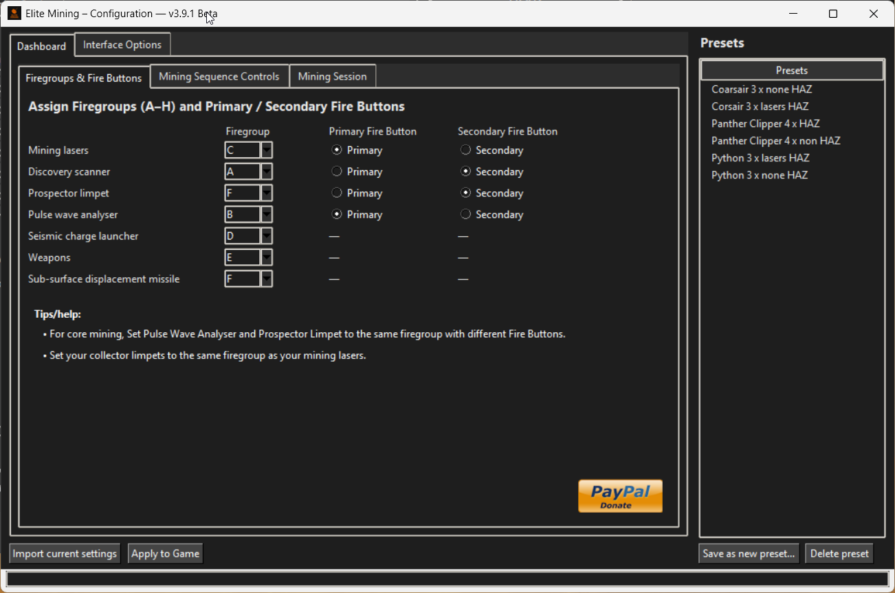
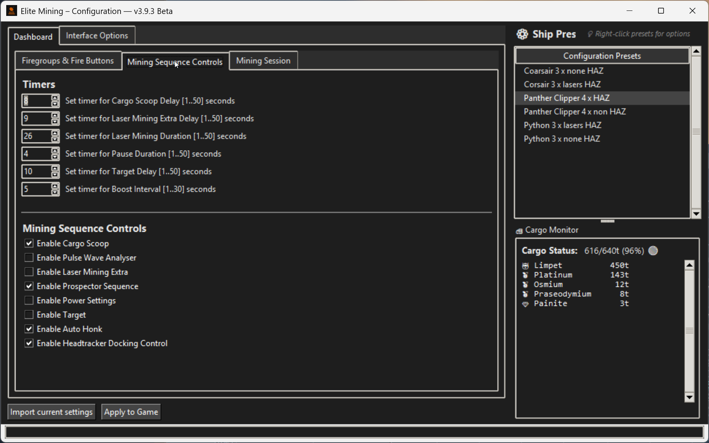
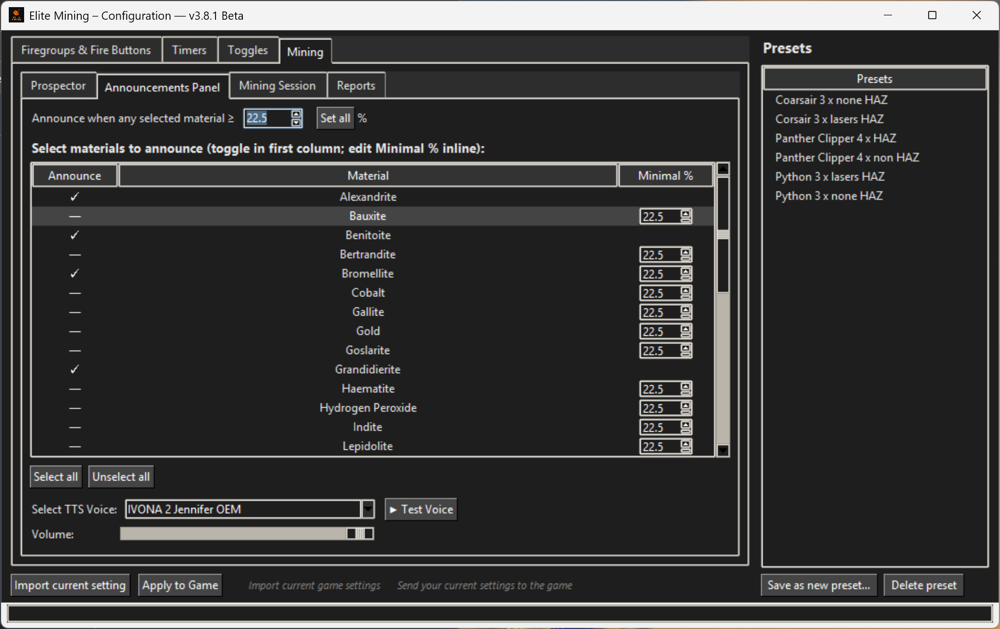
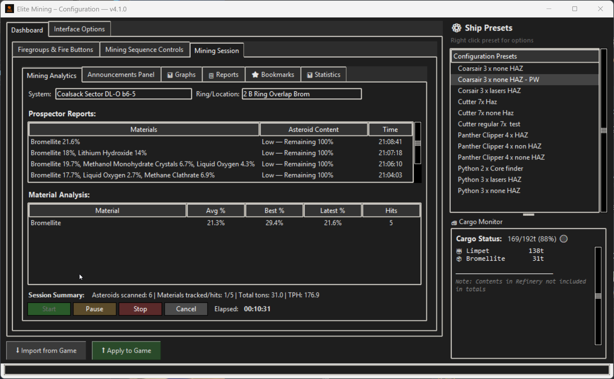
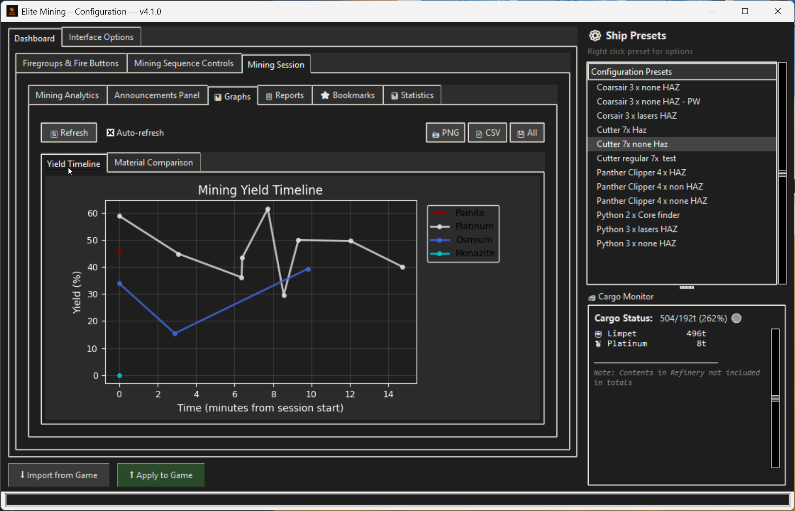
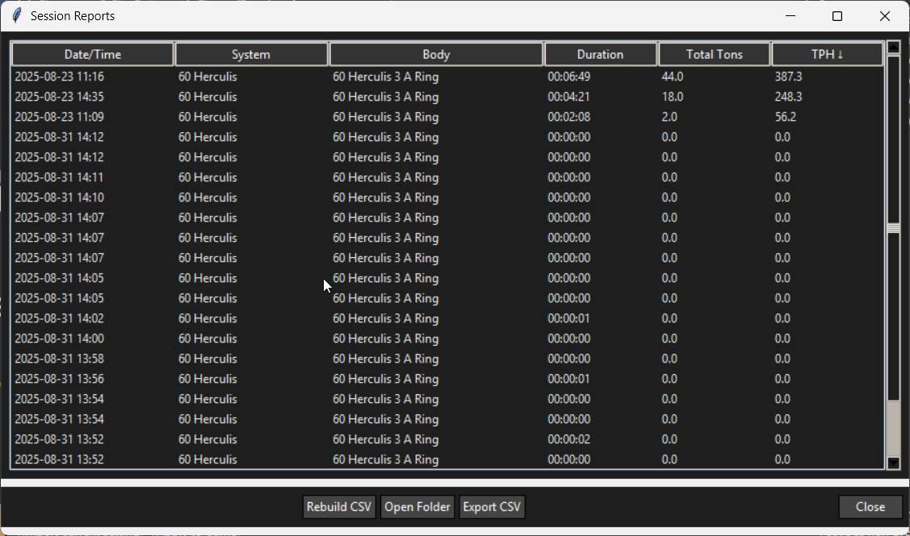

#  EliteMining

**EliteMining** optimizes your mining efficiency with live prospecting analytics, automated announcements, and performance tracking as a standalone application. Optional VoiceAttack integration enables voice-controlled mining sequences for complete hands-free operation.

**Note:** This documentation may not reflect the latest features and improvements and will be updated in the very near future. Please refer to the [v3.9.1-beta Release Notes](https://github.com/Viper-Dude/EliteMining/releases/tag/3.9.1b) for the most current feature information and updates.

---

📑 Table of Contents

- [Usage Options](#-usage-options)
- [Features](#-features)
- [Requirements](#-requirements)
- [Installation](#-installation)
- [Configurator](#️-configurator)
- [Getting Started](#-getting-started)
  - [Firegroup (FG) Setup](#firegroup-fg-setup)
  - [Recommended Key / HOTAS Bindings](#recommended-key--hotas-bindings)
- [Commands](#-commands)
  - [Status Checks](#-status-checks)
  - [Firegroup & Parameter Commands](#-firegroup--parameter-commands)
  - [Miscellaneous](#-miscellaneous)
- [Mining Presets](#-mining-presets)
  - [Hazardous Mining Preset](#hazardous-mining-preset)
  - [Customization](#customization)
- [Usage Tips](#-usage-tips)
- [Known Limitations](#-known-limitations)
- [Training Speech Recognition](#-training-speech-recognition)
- [In Development](#-in-development)
- [Contact](#-contact)
- [Disclaimer](#-disclaimer)
- [Credits](#-credits)

---

## 🎯 Usage Options

### VoiceAttack Integration (Full Automation)
Complete voice/hotkey-controlled mining with automated sequences and announcements.

### Standalone Mode (Manual Control)
For pilots who prefer manual mining without automated sequences or voice commands, the Configurator works independently to provide mining announcements, session tracking, and ship configuration. VoiceAttack is not required for these features.

---

## ✨ Features

### With VoiceAttack (Full Experience)
- Voice/hotkey-controlled mining sequences
- Automated collector and prospector deployment
- Smart targeting and laser management
- Real-time mining statistics
- Automated cargo management
- Custom voice commands to automate mining operations
- Customizable ship presets
- Streamlined workflow for efficient mining
- Compatible with [EliteAPI by Somfic](https://docs.somfic.dev/projects/eliteva) for automatic in-game data reading

### Standalone Features (No VoiceAttack Required)
- Mining announcements and notifications
- Session tracking and reports
- Ship configuration management
- Mining session history
- Manual control interface
- Graphical interface to adjust firegroups, toggles, timers, and announcement options

---

## 📦 Requirements

**Essential:**
- **Elite Dangerous** (PC version)

**For Voice Command Automation:**
- **[EliteVA (API) by Somfic](https://docs.somfic.dev/projects/eliteva)**  
- **[VoiceAttack](https://voiceattack.com/)** – Paid version  
- **Working microphone** for voice commands  

**Note:** VoiceAttack is optional - the Configurator can run standalone for mining announcements, session tracking, and manual configuration without any voice automation.

---

## 💾 Installation

- **Installer**: Run `EliteMiningSetup.exe` for complete installation with VoiceAttack profile
- **Portable**: Extract `EliteMining_3.9.0-beta.zip` for manual installation

### Manual Installation Steps:
1. Download the latest release from [this repository](https://github.com/Viper-Dude/EliteMining/releases)  
2. Extract all contents of the downloaded file into your VoiceAttack app folder  
3. Open VoiceAttack → **Profile > Import Profile**  
4. Select **EliteMining-Profile.vap**  

---

## 🖥️ Configurator

The **Configurator** is a standalone tool included with EliteMining. It provides a graphical interface to easily adjust firegroups, toggles, timers, and announcement options without editing VoiceAttack directly.

If you prefer manual control over automated sequences and don't want voice commands, the Configurator can be used as a standalone application for mining announcements, session reports, and configuration management - VoiceAttack is not required for these features.

### Launching the Configurator
- Say **"Open Configurator"** in VoiceAttack, **or**  
- Press **Right Ctrl + Right Shift + C** on your keyboard.
- - Outside Voiceattack, run Elitemining (shortcuts from desktop) or from folder \EliteMining\Configurator\Configurator.exe 

### Using the Configurator
1. **Dashboard - Firegroups & FireButtons Tab** – Assign Fire Buttons and Firegroups.  
2. **Dashboard - Timers/Toggles Tab** – Enable or disable functions.  
3. **Mining Session Tab** – Provides tools for in-game mining operations (Prospector, Announcement Panel, Mining Session, Reports).  

---

### 📸 Screenshots  

#### Main Window & Firegroups  
  
*Shows the overall Configurator layout, Firegroups, and Fire Buttons.  
Save, Import, and Preset options are always visible across all tabs.*  

#### Timers/Toggles Tab  
  

#### Interface Options Tab  
  
*Configure interface settings, announcement preferences, and user interface options for optimal mining experience.*  

#### Cargo Hold Tab  
  
*Monitor your cargo hold status, track collected materials, and manage inventory during mining sessions.*  

---

### 🪓 Mining Session Tab  

The Mining tab provides dedicated tools for in-game mining operations.  

#### Announcement Panel  
  
*Controls material announcements, minimal, material conntent % and filtering of core vs non-core finds.*  

#### Mining Session  
  
*Tracks current mining session time, prospector  reports, materials collected, analysis, and progress.*  
  
  

#### Reports  
  
*Provides detailed mining statistics and session summaries.*  

---

## 🚀 Getting Started

### Firegroup (FG) Setup
| Component | FG | Fire Button | Notes |
|-----------|----|-------------|-------|
| Discovery Scanner | Set by command or presets | Secondary | – |
| Surface Scanner | A | Primary | – |
| Mining Lasers | Set by command or presets | Primary | – |
| Collector Limpet Controller | Set by command or presets | Same as Mining Lasers (and SSDM) | Must be set manually |
| Pulse Wave Analyser | Set by command or presets | Primary | – |
| Sub-surface Displacement Missile (SSDM) | Set by command or presets | Primary | – |
| Prospector Limpet Controller | Same as Pulse Wave Analyser (recommended) | Secondary | Must be set manually |

**Important:** Collector & Prospector Limpet Controllers **must be set manually**.

---

### Recommended Key / HOTAS Bindings
| Action | Description |
|--------|-------------|
| Stop profiles command | Stopping all running commands inside this profile.. |
| Start Mining Sequence | Starts laser mining sequence |
| Reset Mining Sequence | Stops/resets mining sequence |
| Deploy Seismic Charge Launcher | Switch FG to Seismic Charge Launcher |
| Deploy Weapons | Switch FG to weapons |
| Start Scanning for Cores | Starts scanning sequence (FG set, continuous boost + pulsewave) |
| Stop Scanning for Cores | Stops scanning sequence |
| Clear and Jump | Clears mass lock & activates Supercruise/FSD jump/drop from Supercruise |
| TrackIR Integration | Set pause toggle in TrackIR software to **F9** |

---

## 🎙️ Commands

### ✅ Status Checks
| Spoken Command | Description |
|----------------|-------------|
| "Say firegroup for weapons" | Reports FG for weapons |
| "Say firegroup for mining lasers" | Reports FG for mining lasers |
| "Say firegroup for Sub-surface Displacement Missile" | Reports FG for SSDMs |
| "Say firegroup for Pulse Wave Analyser" | Reports FG for PWA |
| "Say toggle for cargo scoop / power / mining / etc." | Reports toggle status |
| "Say timer for laser mining / target / pause" | Reports active timer values |

---

### 🔧 Firegroup & Parameter Commands
| Spoken Command | Description |
|----------------|-------------|
| "Set firegroup for Discovery Scanner to [A–H]" | Assigns Discovery Scanner |
| "Set firegroup for mining lasers to [A–H]" | Assigns Mining Lasers |
| "Set firegroup for Pulse Wave Analyser to [A–H]" | Assigns PWA |
| "Set firegroup for Seismic Charge Launcher to [A–H]" | Assigns Seismic Charge Launcher |
| "Set firegroup for Sub-surface Displacement Missile to [A–H]" | Assigns SSDM |
| "Set firegroup for weapons to [A–H]" | Assigns weapons |

Additional categories:
- **Commands – Set Firegroups (FG)**  
- **Commands – Set Timers**  
- **Commands – Set Toggles**  
- **Commands – Check – Status**  

---

### 🎮 Miscellaneous
| Spoken Command | Description |
|----------------|-------------|
| "Landing Request" | Requests docking + extends landing gear after 5s |
| "Enable/Disable Autohonk" | Toggles auto-discovery scan after jump (enabled by default) |

---

## ⚡ Mining Presets

### Hazardous Mining Preset
- **Command:** `"Set mining configuration for 3 x haz"`  
- **Configuration includes:**
  - Firegroups set for all mining tools  
  - Timers optimized for laser mining  
  - Toggles adjusted for power management  

Mining in HAZ area with 4 x lasers or more will in normal condition require a 2 step laser mining sequence.
(Timer for laser mining, Pause and Timer for Laser mining extra)

### Customization
- Add new presets for different ships  
- Adjust firegroups, timers, and toggles on-the-fly  
- Modify via built-in commands  

---

## 💡 Usage Tips
- **Short press** → Starts command  
- **Long press** → Stops/resets command  

Enable **"Shortcut is invoked when long-pressed"** in VoiceAttack.

**Best practice:**
1. Set fire buttons & FGs  
2. Select a ship preset  
3. Begin mining and practice commands  

---

## 🚧 In Development
TBA 

---

## ⚠️ Known Limitations
- Only works with in-game keyboard keybindings (HOTAS setup required manually)  
- Potential conflicts with HCS VoicePack (adjust commands if needed)  
- Works fine with EDCopilot  

---

## � Training Speech Recognition
1. Open VoiceAttack  
2. Navigate: **Help → Utilities → Recognition Training**  
3. Follow the prompts  
4. Train in a quiet environment with your gaming microphone  

👉 Backup your speech profile: [SpProfileMgr.zip](https://voiceattack.com/filesend.aspx?id=SpProfileMgr.zip)  

---

## ❓ Contact 
For business or collaboration inquiries, feel free to reach out to me on Discord:  

### 💬 Community & Support
Join the discussion and get help from the community:  
**[EliteMining Discussion Forum](https://github.com/Viper-Dude/EliteMining/discussions/4)** - Share tips, ask questions, and connect with other commanders using EliteMining.

---

## 📜 Disclaimer
This profile is **work-in-progress** and **not affiliated with Frontier Developments**.  
Use at your own risk.

---

## 👏 Credits
- [Somfic](https://docs.somfic.dev/projects/eliteva) – Creator of EliteVA
