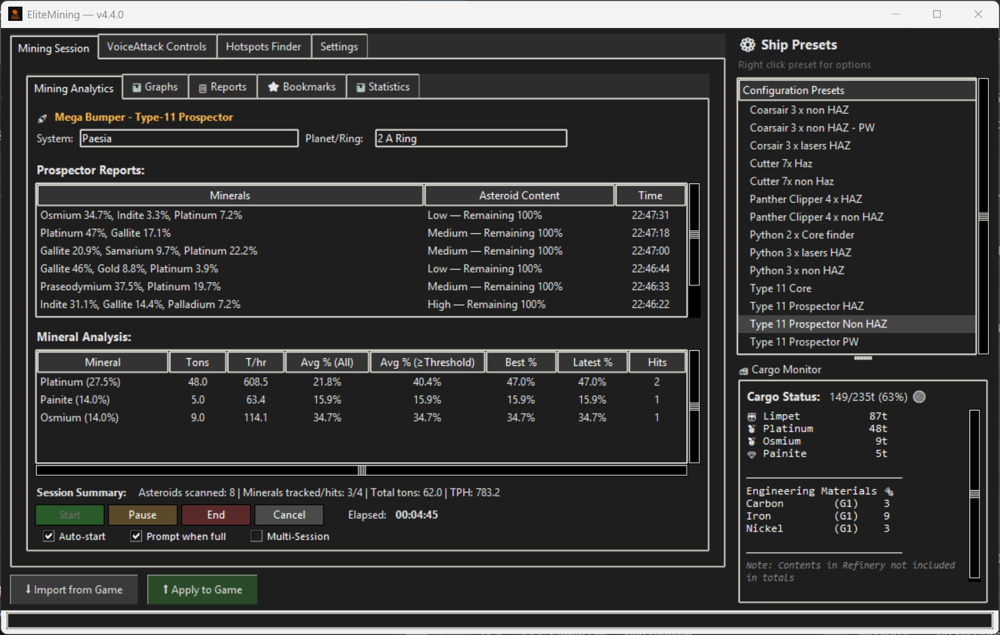

#  EliteMining

**EliteMining** optimizes your mining efficiency with live analytics, automated announcements, performance tracking, and a comprehensive hotspot finder with 32,000+ mining locations as a standalone application. Optional VoiceAttack integration enables voice/hotkey mining sequences for complete hands-free operation.

---

Table of Contents

- [Usage Options](#usage-options)  
- [Features](#features)  
- [Requirements](#requirements)  
- [Installation](#installation)  
- [Configurator](#configurator)  
  - [EliteMining GUI](#elitemining-gui)  
  - [Backup & Restore](#backup--restore)  
- [Hotspot Finder](#hotspot-finder)  
- [Getting Started](#getting-started)  
- [Commands](#commands)  
- [Mining Presets](#mining-presets)  
- [Usage Tips](#usage-tips)  
- [Known Limitations](#known-limitations)  
- [Training Speech Recognition](#training-speech-recognition)  
- [In Development](#in-development)  
- [Contact](#contact)  
- [License](#license--third-party-notices)  
- [Credits](#credits)  

---

## Usage Options

### VoiceAttack Integration (Full Automation)  
Complete voice/hotkey-controlled mining with automated sequences and announcements.  

### Standalone Mode (Manual Control)  
The Configurator works independently for announcements, reports, and tracking. VoiceAttack is not required.  

[Back to Top](#elitemining)

---

## Features

### With VoiceAttack (Full Experience)  
- Voice/hotkey mining sequences  
- Automated collector & prospector deployment  
- Smart targeting & laser management  
- Real-time mining statistics  
- Cargo management automation  
- Custom commands & presets  
- Compatible with [EliteAPI by Somfic](https://docs.somfic.dev/projects/eliteva)  

### Standalone Features (No VoiceAttack Required)  
- Mining announcements & notifications  
- Session tracking & history  
- Ship configuration management  
- GUI for firegroups, timers, toggles, and announcements  
- **Detailed HTML Reports** – Generate detailed reports with charts, screenshots, and analytics tooltips  
- **Hotspot Finder** – Search 32,000+ mining hotspots by material, ring type, and distance with detailed location data  
- **Backup & Restore** – Save and restore full setup including settings, bookmarks, and reports  

[Back to Top](#elitemining)

---

## Hotspot Finder

The Hotspot Finder provides access to a comprehensive database of 32,000+ confirmed mining hotspots with detailed location data, material information, and intelligent filtering capabilities.

### Key Features
- **Search Planetary Rings** – Find optimal mining rings (Ice, Metal Rich, Rocky, Metallic)
- **Filter by Material** – Search for specific materials (Painite, Platinum, Low Temperature Diamonds, etc.)
- **Pre-loaded Database** – 32,000+ hotspots with material types, ring densities
- **Auto-Import & Tracking** – Automatically imports hotspots from journal files and tracks new discoveries
- **Distance-Based Results** – Filter by jump range to find nearby opportunities
- **Ring Composition Details** – View ring density and distance from arrival
- **Smart Sorting** – Results ranked by distance, hotspot overlaps, and ring density

Automatically imports hotspots from your Elite Dangerous journal files and continuously tracks newly discovered locations.

   
*Hotspot Finder showing search results with material filters and distance calculations.*

[Back to Top](#elitemining)

---

## Requirements

Click to expand

**Essential:**  
- **Elite Dangerous** (PC version)  

**For VoiceAttack Integration:**  
- **[EliteVA (API) by Somfic](https://docs.somfic.dev/projects/eliteva)** *(included in installer)*  
- **[VoiceAttack](https://voiceattack.com/)** – Paid version  
- **Microphone** for voice commands  

### Keybind Requirement for EliteVA  
EliteVA requires the `Custom.binds` file:  

1. Open **Elite Dangerous → Options → Controls**  
2. Set preset to **Custom**  
3. Save — this creates/updates `Custom.binds`  

**Note:** VoiceAttack is optional. Configurator can run standalone.  

[Back to Top](#elitemining)

---

## Installation

- **Installer:** Run `EliteMiningSetup.exe` (includes VoiceAttack profile)  
- **Portable:** Extract `EliteMining_3.9.0-beta.zip`  

> **Antivirus Notice:** If your antivirus flags the application, this is a common false positive with Python-compiled apps - simply add an exclusion for the installation folder.
> 
> **After Updates and New Installs:** System/ring location may appear empty until you relog into Elite Dangerous (one-time refresh).

### Included Components  
The installer bundles the **EliteVA plugin**. No separate download required.  

### Manual Installation  
1. Download the latest `.zip` from [Releases](https://github.com/Viper-Dude/EliteMining/releases)  
2. Extract into your VoiceAttack app folder  
3. Open VoiceAttack → **Profile > Import Profile**  
4. Select **EliteMining-Profile.vap**  

[Back to Top](#elitemining)

---

## Configurator  

The **Configurator** lets you adjust firegroups, toggles, timers, and announcements via GUI. It can run standalone without VoiceAttack.  

### Launching  
- VoiceAttack: **"Open Configurator"**  
- Keyboard: **Right Ctrl + Right Shift + C**  
- Direct: `\EliteMining\Configurator\Configurator.exe`  

[Back to Top](#elitemining)

---

### EliteMining GUI  

#### Main Window (Dashboard) & Firegroups  
   
*Configurator layout with firegroups & buttons.*  

#### Timers/Toggles Tab  
   
*Configure timers and toggles for automation.*  

---

### Mining Session Tab  

#### Announcement Panel  
   
*Controls announcements, thresholds, and filters.*  

#### Mining Session  
   
*Tracks time, prospector reports, materials, and progress.*  

   
*Yield comparisons across sessions.*  

   
*Material collection comparisons.*  

#### Reports 
   
*Detailed mining statistics and summaries.*  

#### Detailed HTML Reports  
*HTML reports with charts and statistics.*  

> **Work in Progress:** The detailed HTML report system is under active development. New features and improvements are being added regularly. Report layouts, analytics calculations, and data presentation may change in future updates.

Generate comprehensive HTML reports with interactive charts, mining analytics, and session comments. Features include:
- **Dark/Light Theme Toggle** - Switch between themes with one click  
- **Session Comments** - Add notes and observations to your reports  
- **Visual Charts** - Material breakdowns and performance graphs  
- **Screenshot Integration** - Attach screenshots to document your sessions  
- **Overall Statistics** - Compare current session to your mining history
- **Analytics Tooltips** - Hover explanations for all efficiency metrics
- **Clickable Images** - Charts and screenshots expand to full size
- **Data Preservation** - Reports protected during software updates
- **Export Options** - CSV, HTML, and PDF formats available

**File Locations:**
- Reports saved to: `Reports/Mining Session/`
- Screenshots: `Reports/Mining Session/Detailed Reports/Screenshots/`
- Performance graphs: `Reports/Mining Session/Graphs/`  

Right-click any mining session to generate a detailed report, add screenshots, or manage existing reports. All reports are saved with your session data and can be opened directly from the reports tab.

#### Bookmarks  
   
*Save, search, and manage mining spots.*  

#### Comprehensive Analytics  
   
*Session statistics: yields, hit rates, and comparisons.*  

---

#### Settings Tab  
   
*UI and announcement preferences.*  

[Back to Top](#elitemining)

---

### Backup & Restore 
- Easily save and restore your complete EliteMining setup including settings, bookmarks, and reports. Create timestamped backups before updates or quickly restore previous configurations with one click.  

   

[Back to Top](#elitemining)

---

## Getting Started

Click to expand

### Firegroup (FG) Setup  
| Component | FG | Fire Button | Notes |
|-----------|----|-------------|-------|
| Discovery Scanner | Preset/Command | Secondary | – |
| Surface Scanner | A | Primary | – |
| Mining Lasers | Preset/Command | Primary | – |
| Collector Limpet Controller | Preset/Command | Same as Mining Lasers | Must set manually |
| Pulse Wave Analyser | Preset/Command | Primary | – |
| SSDM | Preset/Command | Primary | – |
| Prospector Limpet Controller | Same as PWA | Secondary | Must set manually |

### Key / HOTAS Bindings  
| Action | Description |
|--------|-------------|
| Stop profiles command | Stops all running commands |
| Start Mining Sequence | Starts laser mining |
| Reset Mining Sequence | Stops/resets mining |
| Deploy Seismic Charge Launcher | Switch to launcher |
| Deploy Weapons | Switch to weapons |
| Start Scanning for Cores | Scanning sequence |
| Stop Scanning for Cores | Stops scanning |
| Clear and Jump | Clears mass lock & jumps |
| TrackIR Integration | Pause toggle = **F9** |

[Back to Top](#elitemining)

---

## Commands

Click to expand

### Status Checks  
| Spoken Command | Description |
|----------------|-------------|
| "Say firegroup for weapons" | Reports FG for weapons |
| "Say firegroup for mining lasers" | Reports FG for lasers |
| "Say firegroup for SSDM" | Reports FG for SSDMs |
| "Say firegroup for PWA" | Reports FG for PWA |
| "Say toggle for cargo scoop" | Reports toggle status |
| "Say timer for laser mining" | Reports active timer |

### Firegroup & Parameter Commands  
| Spoken Command | Description |
|----------------|-------------|
| "Set firegroup for Discovery Scanner to [A–H]" | Assigns Discovery Scanner |
| "Set firegroup for mining lasers to [A–H]" | Assigns Mining Lasers |
| "Set firegroup for PWA to [A–H]" | Assigns PWA |
| "Set firegroup for Seismic Launcher to [A–H]" | Assigns Launcher |
| "Set firegroup for SSDM to [A–H]" | Assigns SSDM |
| "Set firegroup for weapons to [A–H]" | Assigns weapons |

### Miscellaneous  
| Spoken Command | Description |
|----------------|-------------|
| "Landing Request" | Requests docking |
| "Enable/Disable Autohonk" | Toggles auto scan |

[Back to Top](#elitemining)

---

## Mining Presets

Click to expand

### Hazardous Mining Preset  
- **Command:** `"Set mining configuration for 3 x haz"`  
- Pre-configured firegroups, timers, and toggles for HAZ mining.  

### Customization  
- Create presets for different ships  
- Adjust firegroups/timers on-the-fly  
- Modify via built-in commands  

[Back to Top](#elitemining)

---

## Usage Tips
- **Short press** → Starts command  
- **Long press** → Stops/resets command  
- Enable **"Shortcut is invoked when long-pressed"** in VoiceAttack  

[Back to Top](#elitemining)

---

## Known Limitations
- **Only works with in-game keybinds (HOTAS setup manual)**
- **There may be conflicts with HCS VoicePack commands, but these can be easily adjusted manually in the EliteMining Profile within VoiceAttack.**
- **Works with EDCopilot**

> **Note:** VoiceAttack startup warnings about EliteVA plugin bindings are normal due to recent Elite Dangerous changes and can be safely ignored - they don't impact EliteMining voice commands.

[Back to Top](#elitemining)

---

## Training Speech Recognition

Click to expand

1. Open VoiceAttack  
2. Go to **Help → Utilities → Recognition Training**  
3. Train in a quiet environment  
4. Backup your speech profile: [SpProfileMgr.zip](https://voiceattack.com/filesend.aspx?id=SpProfileMgr.zip)  

[Back to Top](#elitemining)

---

## In Development  
TBA  

[Back to Top](#elitemining)

---

## Contact  

### Community Support
Join our Discord server for real-time help, mining tips, and community discussions:  

### Other Resources
- **GitHub Discussions:** [EliteMining Forum](https://github.com/Viper-Dude/EliteMining/discussions/4)
- **Bug Reports:** [GitHub Issues](https://github.com/Viper-Dude/EliteMining/issues)

[Back to Top](#elitemining)

---

## License & Third-Party Notices  

**EliteMining** © 2025 CMDR ViperDude.  
Distributed under the [MIT License](LICENSE.md).  

This project bundles:  
- **ELITEVA** © 2023 Somfic – MIT License  

[Back to Top](#elitemining)

---

## Credits  
- [Somfic](https://docs.somfic.dev/projects/eliteva) – Creator of EliteVA  

[Back to Top](#elitemining)