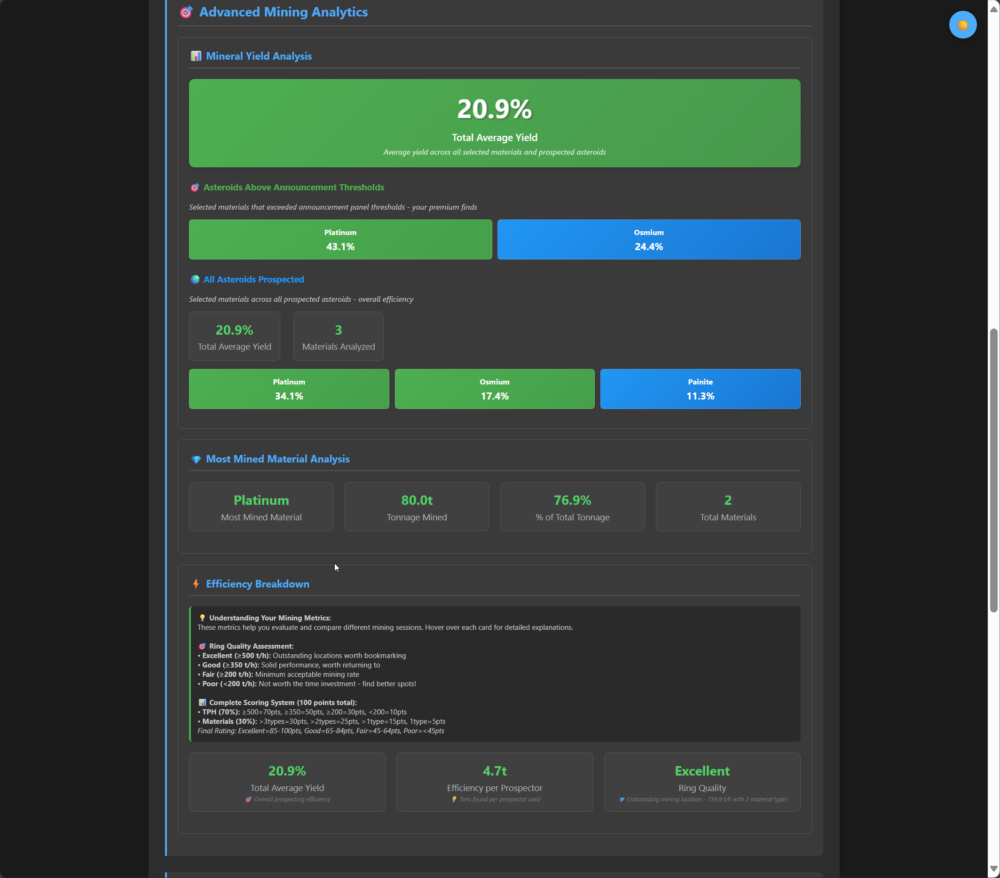
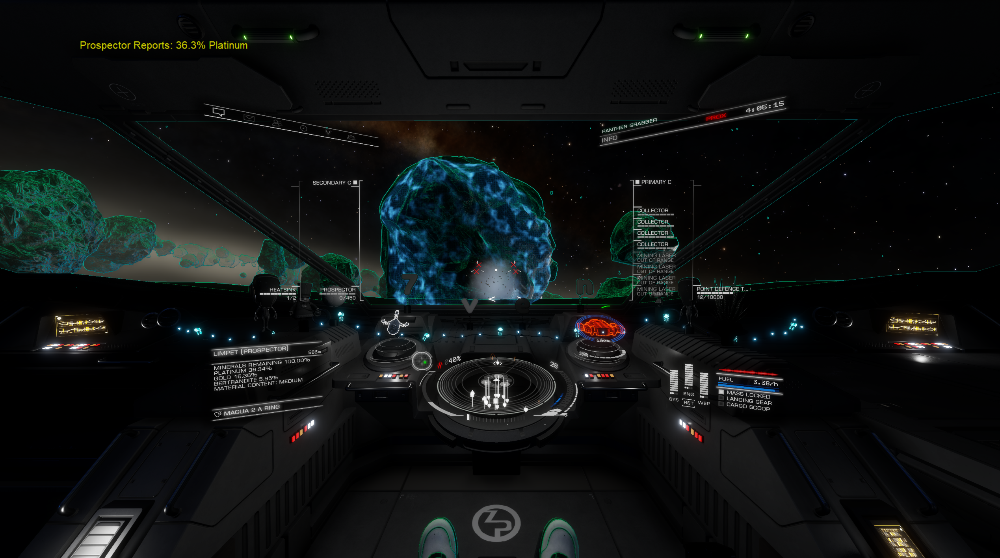

#  EliteMining

**EliteMining** optimizes your mining efficiency with live analytics, automated announcements, performance tracking, and a comprehensive hotspot finder with 61,000+ mining locations, overlaps, and RES sites as a standalone application. Optional VoiceAttack integration enables voice/hotkey mining sequences for complete hands-free operation.

---

Table of Contents

- [Features and Usage Options](#features-and-usage-options)
- [Requirements](#requirements)
- [Installation](#installation)
- [EliteMining App](#elitemining-app)
- [Hotspot Finder](#hotspot-finder)
- [Commodity Market](#commodity-market)
- [Mining Missions](#mining-missions)
- [Ring Mining Reference](#ring-mining-reference)
- [Star Systems](#star-systems)
- [Distance Calculator](#distance-calculator)
- [Getting Started](#getting-started)
- [VoiceAttack Commands](#voiceattack-commands)
- [Mining Presets](#mining-presets)
- [Usage Tips](#usage-tips)
- [Known Limitations](#known-limitations)
- [Training Speech Recognition](#training-speech-recognition)
- [In Development](#in-development)
- [FAQ](#faq)
- [Contact](#contact)
- [License](#license--third-party-notices)
- [Credits](#credits)

---

## Features and Usage Options

### Standalone (Without VoiceAttack)
Full-featured mining companion with GUI controls:
- Real-time mining statistics  
- Automated cargo monitoring  
- Mining announcements & notifications  
- **Engineering materials tracking** – Monitor raw materials by grade
- **Auto-start mining session** – Automatically begins tracking when you fire your first prospector limpet
- **Auto-Switch Tabs** – Automatically switches to Mining Session when you fire a prospector, returns to Hotspots Finder after session ends
- **Cargo full notification** – Prompts you to end session when cargo hold is 100% full and idle for 1 minute
- Session tracking & history  
- Ship configuration management  
- GUI for firegroups, timers, toggles, and announcements  
- **Detailed HTML Reports** – Generate detailed reports with charts, screenshots, and analytics tooltips  
- **Hotspot Finder** – Search 61,000+ mining hotspots by minerals, ring type, and distance with detailed location data  
- **Overlaps** – Find and tag double/triple hotspot overlaps for maximum yield  
- **RES Sites** – Locate Resource Extraction Sites (Hazardous, High, Low)  
- **Commodity Market** – Find the best sell prices for your mined commodities with real-time market data and distance calculations  
- **Mining Missions** – Track active mining missions and find hotspots or selling stations directly from mission requirements  
- **Backup & Restore** – Save and restore full setup including settings, bookmarks, and reports

### With VoiceAttack Integration (Optional)
All standalone features **plus** voice/hotkey automation:
- Voice/hotkey mining sequences  
- Automated collector & prospector deployment  
- Smart targeting & laser management  
- Custom commands & presets
- Ship presets
- Includes [EliteAPI by Somfic](https://docs.somfic.dev/projects/eliteva) (bundled with installer)  

[Back to Top](#top)

---

## Requirements

Click to expand

**Essential:**  
- **Elite Dangerous** (PC version)  

**For VoiceAttack Integration:**  
- **[EliteVA (API) by Somfic](https://docs.somfic.dev/projects/eliteva)** *(included in installer)*  
- **[VoiceAttack](https://voiceattack.com/)** – Paid version  
- **Microphone** for voice commands  

### Keybind Requirement for EliteVA  
EliteVA requires the `Custom.binds` file:  

1. Open **Elite Dangerous → Options → Controls**  
2. Set preset to **Custom**  
3. Save — this creates/updates `Custom.binds`  

### Custom Keybinds for Mining Control  
VoiceAttack profile includes a dedicated **"Custom Keybinds for Mining Control"** category. Configure your mining hotkeys here instead of searching through the entire profile.

**Note:** VoiceAttack is optional. EliteMining App can run standalone.  

[Back to Top](#top)

---

## Installation

- **Installer:** Run `EliteMiningSetup.exe` (includes VoiceAttack profile)  

> **Antivirus Notice:** If your antivirus flags the application, this is a common false positive with Python-compiled apps - simply add an exclusion for the installation folder.
> 
> **After Updates and New Installs:** System/ring location may appear empty until you relog into Elite Dangerous (one-time refresh).

### Included Components  
The installer bundles the **EliteVA plugin**. No separate download required.  

### VoiceAttack  Installation  
1. Open VoiceAttack → Profile → Import Profile  
2. Select **EliteMining v4.76-Profile.vap** (versioned format)  
3. Configure your mining hotkeys in the **"Custom Keybinds for Mining Control"** category

**Note (v4.76+):** Keybind preservation is now automatic! When updating, EliteMining will prompt you to export your profile and automatically merge your keybinds into the new version.

### Preserving Keybinds During Updates (v4.76+)
EliteMining now automatically detects when a new VoiceAttack profile is available and guides you through keybind preservation:
1. Start EliteMining after updating
2. Follow the on-screen prompt to export your current profile as XML
3. Select the exported file
4. Your keybinds will be automatically merged into the new profile
5. Import the updated profile in VoiceAttack

**Manual method:** You can also export your profile beforehand (Profile → Export Profile, save as XML format) and use it during the merge process.

[Back to Top](#top)

---

## EliteMining App  

The **EliteMining App** provides a comprehensive GUI for configuring mining automation, tracking sessions, and managing all settings. It can run standalone without VoiceAttack.

### Start EliteMining  
- EliteMining Desktop icon or direct: `\EliteMining\Configurator\EliteMining.exe`

[Back to Top](#top)

---

## VoiceAttack Controls

Configure automation sequences for VoiceAttack integration. These settings can be adjusted via GUI even if running standalone.

### Firegroups & Fire Buttons

Configure Elite Dangerous firegroups (A-H) and fire buttons (Primary/Secondary) for automated mining sequences:

   
*Firegroups configuration for mining tools and fire button assignments.*

**Available Tools:**
- **Mining Lasers/MVR** – Automated laser mining with configurable duration
- **Discovery Scanner** – System honk on FSD arrival  
- **Prospector Limpet** – Launch and auto-target asteroids
- **Pulse Wave Analyser** – Core asteroid scanning
- **Seismic Charge Launcher** – Fissure targeting for core mining
- **Weapons** – Defense firegroup configuration
- **Sub-surface Displacement Missile** – Deposit extraction

### Mining Controls

Control mining sequence timing and automated behaviors:

   
*Mining controls for automation sequences.*

**Timers:** Configure duration for laser periods, pauses, and delays (1-50 seconds range)

**Toggles:**
- **Auto Honk** – Scan system automatically on FSD arrival
- **Cargo Scoop** – Auto-retract when mining completes
- **Headtracker Docking Control** – Toggle headtracker (F9) for docking
- **Laser Mining Extra** – Second laser period with cooldown pause
- **Night Vision** – Auto-enable when starting mining
- **FSD Jump Sequence** – Auto-chain jumps with system map toggle
- **Power Settings** – Max engines during mining, balance when complete
- **Prospector Sequence** – Auto-target prospector after launch
- **Pulse Wave Analyser** – Auto-switch to PWA firegroup after mining
- **Target** – Deselect prospector when mining completes

💡 **Tip:** Use "Stop all profile commands" in VoiceAttack to interrupt any active sequence.

[Back to Top](#top)

---

## Hotspot Finder

The Hotspot Finder provides access to a comprehensive database of 61,000+ confirmed mining hotspots with detailed location data, minerals information, and intelligent filtering capabilities, plus integrated Spansh data.

### Key Features
- **Search Planetary Rings** – Find optimal mining rings (Ice, Metal Rich, Rocky, Metallic)
- **Filter by Minerals** – Search for specific minerals (Painite, Platinum, Low Temperature Diamonds, etc.)
- **Spansh Data Integration** – Search includes Spansh.co.uk data alongside your personal scans for comprehensive coverage (~50 LY typical, Ring Search mode reaches 300 LY)
- **Ring Type Only Search** – Find rings by type without requiring hotspot data, useful for exploring unmarked rings
- **Data Source Selection** – Choose between Database (your scans), Spansh (Spansh data), or Both for best results
- **Min Hotspots Filter** – Filter results to show only rings with X or more hotspots (1-20 range, available when specific mineral selected)
- **Save to Local Database** – Right-click Spansh results to save them to your personal database for offline access (max 50 rows)
- **Update Reserve Level** – Right-click local entries with missing reserve data to fetch and update from Spansh
- **Auto-Search** – Automatically searches for hotspots when jumping to new systems and auto-refreshes results when scanning rings (remembers preference across restarts)
- **Pre-loaded Database** – 61,000+ hotspots with minerals types, ring densities
- **Auto-Import & Tracking** – Automatically imports hotspots from journal files and tracks new discoveries
- **Distance-Based Results** – Filter by jump range (up to 500 LY) to find nearby opportunities
- **Ring Composition Details** – View distance from arrival (LS) with comma-separated formatting
- **Smart Sorting** – Results ranked by distance and hotspot overlaps
- **Overlap Tracking** – Add and find hotspot overlaps (2x, 3x) for higher yield mining locations
- **RES Site Tracking** – Add and find Resource Extraction Sites (Hazardous, High, Low) for combat mining
- **Pre-loaded Overlap & RES Data** – Ships with 161 known overlaps and 71 RES site locations

### Setting & Managing Overlap/RES Data
- **Set Overlap** – Right-click any ring to set hotspot overlaps (2x, 3x) for specific minerals
- **Set RES** – Right-click any ring to set Resource Extraction Sites (Hazardous, High, Low)
- **Remove Overlap/RES** – Select "None" in the Set Overlap/RES dialog to remove existing entries
- **Bookmarks** – Overlap and RES data saved in bookmarks also syncs to the Ring Finder database
- Data is stored locally and appears in all future searches

Automatically imports hotspots from your Elite Dangerous journal files and continuously tracks newly discovered locations.

   
*Hotspot Finder showing search results with minerals filters and distance calculations.*

[Back to Top](#top)

---

## Commodity Market

The Commodity Market helps you find the best prices for mining commodities and trade goods using real-time market data from the Ardent API, with automatic distance calculations to help you maximize profits.

### Key Features
- **Two Tabs:**
  - **Mining Commodities** – Search for 28 mineable resources (Painite, Platinum, Low Temperature Diamonds, etc.)
  - **Trade Commodities** – Search across 15 categories of trade goods (Chemicals, Machinery, Medicines, Technology, and more)
- **Two Search Modes:**
  - **Near System** – Find top 30 stations within 500 LY, filtered by distance
  - **Galaxy-Wide** – Find top 30 best prices anywhere in the galaxy with calculated distances
- **Buy/Sell Toggle:**
  - **Sell Mode** – Find stations buying your commodities (best sell prices)
  - **Buy Mode** – Find stations selling commodities you want to purchase (lowest buy prices)
- **Real-Time Market Data** – Live commodity prices updated from active commanders
- **Smart Filtering:**
  - Station type (Orbital/Surface/Fleet Carrier/MegaShip)
  - Landing pad size (Large pads only option)
  - Exclude Fleet Carriers
- **Distance Calculations** – Automatically calculates jump distance from your reference system
- **Data Freshness** – Shows when prices were last updated (minutes/hours/days ago)
- **Sortable Results** – Click column headers to sort by location, type, distance, demand, or price
- **Threaded Updates** – Results appear instantly with distances calculated in background for smooth performance
- **External Links** – Right-click any search result to:
  - Open station in Inara (station search)
  - Open system in EDSM (system page with all stations)
  - Copy system name to clipboard

Perfect for planning your mining runs and finding the most profitable stations to sell your haul or locate trade goods.

   
*Commodity Market showing mining commodities search results with filters and distance calculations.*

   
*Trade Commodities tab with 15 categories covering all tradeable goods in Elite Dangerous.*

[Back to Top](#top)

---

## Mining Missions

Track your active mining missions and quickly find hotspots or selling stations for mission commodities.

### Key Features
- **Mission Tracking** – View all active mining missions with commodity requirements and progress
- **Find Hotspots** – Search for hotspots directly from mission commodity requirements
- **Find Selling Stations** – Locate nearby stations to deliver mission commodities
- **Auto-Import** – Missions automatically imported from Elite Dangerous journals

   
*Mining Missions tab showing active missions with quick search options.*

[Back to Top](#top)

---

## Ring Mining Reference

Quick reference guide for ring types and mining minerals, accessible from the Mining tab.

### Key Features
- **Ring Type Guides** – Expandable sections for Icy, Metallic, Metal-Rich, and Rocky rings
- **Mineral Categories** – Laser (High/Low) and Core (High/Low) minerals for each ring type
- **RES Sites Reference** – Resource Extraction Site types with pirate levels and mining bonus percentages

   
*Ring Mining Reference showing ring types and RES site bonuses.*

[Back to Top](#top)

---

## Star Systems

Search for nearby star systems with detailed status information. Perfect for finding systems with specific conditions for missions, bounty hunting, or exploration.

### Key Features
- **Current System Info** – View detailed status of your current system (security, allegiance, government, state, economy, population)
- **Nearby System Search** – Find systems within range of your reference system
- **Server-Side Filtering** – Filter by Security, Allegiance, Government, State, Economy, Population
- **Distance Sorting** – Results sorted by distance from reference system
- **Quick Actions:**
  - Right-click to copy system name or open in Inara/EDSM/Spansh
  - "Use Current" button fills reference system instantly

   
*Star Systems tab showing current system info and nearby system search with filters.*

[Back to Top](#top)

---

## Distance Calculator

Calculate distances between any two systems using real-time EDSM data. Perfect for planning long-distance trips, tracking your home base, or finding your fleet carrier.

### Key Features
- **System Distance Calculator** – Calculate precise jump distances between any two star systems
- **Home System Tracking** – Save your home system and see distance from your current location in real-time
- **Fleet Carrier Tracking** – Auto-detect your fleet carrier location from journals or set manually
- **Coordinates & Sol Distance** – View galactic coordinates and distance to Sol for all systems
- **Live Updates** – Distances to Home and Fleet Carrier update automatically when you jump systems
- **Session Memory** – Remembers your last calculated systems and settings between app restarts
- **Quick Actions:**
  - "Use Current" button fills with your current system instantly
  - "Home" and "FC" buttons quickly fill destination field
  - Press Enter to calculate without clicking

   
*Distance Calculator showing system distances with Home and Fleet Carrier tracking.*

[Back to Top](#top)

---

## Getting Started

Click to expand

### Firegroup (FG) Setup  
| Component | FG | Fire Button | Notes |
|-----------|----|-------------|-------|
| Mining Lasers (MVR) | Preset/Command | Primary | – |
| Discovery Scanner | Preset/Command | Secondary | – |
| Prospector Limpet Controller | Same as PWA | Secondary | Must set manually |
| Pulse Wave Analyser | Preset/Command | Primary | – |
| Seismic Charge Launcher | Preset/Command | – | – |
| Weapons | Preset/Command | – | – |
| Sub-surface Displ Missile | Preset/Command | – | – |
| Collector Limpet Controller | Preset/Command | – | Must set manually |

> **⚠️ Important for Automated Firegroup Switching:**  
> For the mining sequence automation to work correctly, **ALL firegroups (A through H) must be populated** in Elite Dangerous, even if you don't actively use them. Not populated firegroups will prevent automatic switching.
> 
>  
> *Example: All 8 firegroups configured (A-H). Unused groups can have any weapon assigned.*

### Key / HOTAS Bindings  
| Action | Description |
|--------|-------------|
| Start mining sequence | Begin automated mining |
| Start prospector | Start prospector sequence |
| Reset mining sequence | Reset to default state |
| Deploy seismic charge launcher | Fire seismic charge |
| Deploy Sub-Surface Displacement Missile | Fire SSDM |
| Deploy weapons | Deploy hardpoints |
| Start Pulse wave scanning | Enable PWA scanner |
| Stop Pulse wave scanning | Disable PWA scanner |
| Clear and jump | Retract hardpoints and jump |
| Toggle Listening | Enable/disable voice recognition |
| Stop all | Emergency stop all sequences |

[Back to Top](#top)

---

### EliteMining GUI  

Click to expand

### Mining Session Tab  

#### Mining Session  
   
*Tracks time, prospector reports, minerals, and progress.*  

   
*Yield comparisons across sessions.*  

   
*Minerals collection comparisons.*  

#### Reports 
   
*Detailed mining statistics and summaries.*  

#### Detailed HTML Reports  
*HTML reports with charts and statistics.*  

> **Work in Progress:** The detailed HTML report system is under active development. New features and improvements are being added regularly. Report layouts, analytics calculations, and data presentation may change in future updates.

Generate comprehensive HTML reports with interactive charts, mining analytics, and session comments. Features include:
- **Dark/Light Theme Toggle** - Switch between themes with one click  
- **Session Comments** - Add notes and observations to your reports  
- **Visual Charts** - Minerals breakdowns and performance graphs  
- **Screenshot Integration** - Attach screenshots to document your sessions  
- **Overall Statistics** - Compare current session to your mining history
- **Analytics Tooltips** - Hover explanations for all efficiency metrics
- **Clickable Images** - Charts and screenshots expand to full size
- **Data Preservation** - Reports protected during software updates
- **Export Options** - CSV, HTML, and PDF formats available

**File Locations:**
- Reports saved to: `Reports/Mining Session/`
- Screenshots: `Reports/Mining Session/Detailed Reports/Screenshots/`
- Performance graphs: `Reports/Mining Session/Graphs/`  

Right-click any mining session to generate a detailed report, add screenshots, or manage existing reports. All reports are saved with your session data and can be opened directly from the reports tab.

#### Discord Integration
*Manually share mining session reports to Discord channels.*  

Share completed mining session summaries to Discord channels via webhook integration. Configure your Discord webhook URL in settings, then manually share individual session reports with custom comments. Reports include materials found, yields, performance metrics, and session duration. 

#### 📊 Mining Cards
Generate shareable PNG cards from your mining sessions.

 

**Features:**
- Session stats, performance metrics, and commodity breakdown
- Add your CMDR name and optional notes
- Right-click any session in Reports → "Mining Card"

Cards saved to: `app/Reports/Mining Session/Cards/`

📸 View HTML Report Screenshots

  

*Click images to view full size*

#### Bookmarks  
   
*Save, search, and manage mining spots.*  

#### Comprehensive Analytics  
   
*Session statistics: yields, hit rates, and comparisons.*  

---

#### Settings Tab  
   
*UI and announcement preferences.*  

#### Announcement Panel  
   
*Controls announcements, thresholds, and filters.*  

   
*Text overlay showing real-time mining announcements in-game.*

   
*Enhanced overlay with improved readability and detailed mining statistics.*

[Back to Top](#top)

---

### Backup & Restore 
- Easily save and restore your complete EliteMining setup including settings, bookmarks, and reports. Create timestamped backups before updates or quickly restore previous configurations with one click.  

   

[Back to Top](#top)

---

## VoiceAttack Commands

Click to expand

Control EliteMining with voice commands. These require VoiceAttack with the EliteMining profile.

### Mining Sequences (Custom Keybinds)
These commands trigger in-game actions. Configure your keybinds in the "Custom Keybinds for Mining Control" category.

| Voice Command | Action |
|---------------|--------|
| Start mining sequence | Begin automated mining |
| Start prospector | Start prospector sequence |
| Deploy Sub-Surface Displacement Missile | Fire SSDM |
| Start Pulse wave scanning | Enable PWA scanner |
| Stop Pulse wave scanning | Disable PWA scanner |
| Deploy seismic charge launcher | Fire seismic charge |
| Clear and jump | Retract hardpoints and jump |
| Deploy weapons | Deploy hardpoints |
| Toggle Listening | Enable/disable voice recognition |
| Stop all | Emergency stop all sequences |
| Reset mining sequence | Reset to default state |

### App Control
| Voice Command | Action |
|---------------|--------|
| Open Elite Mining | Launch the app |
| Close Elite Mining | Close app gracefully |
| Minimize Elite Mining | Minimize to taskbar |
| Restore Elite Mining | Restore from taskbar |

### UI Navigation
| Voice Command | Action |
|---------------|--------|
| Show mining | Switch to Mining Session tab |
| Show hotspots | Switch to Hotspots Finder tab |
| Show market | Switch to Commodity Market tab |
| Show missions | Switch to Mining Missions tab |
| Show ring guide | Switch to Ring Mining Reference tab |
| Show systems | Switch to Star Systems tab |
| Show distance | Switch to Distance Calculator tab |
| Show voice attack | Switch to VoiceAttack tab |
| Show bookmarks | Switch to Bookmarks tab |
| Show settings | Switch to Settings tab |

### Mining Session Control
| Voice Command | Action |
|---------------|--------|
| Start mining | Start mining session |
| Pause mining | Pause/Resume session |
| Stop mining | Stop and save session |
| Cancel mining | Cancel without saving |

### Ship & Announcement Presets
| Voice Command | Action |
|---------------|--------|
| Load preset 1-6 | Load ship preset |
| Save preset 1-6 | Save current config to preset |
| Load announcement 1-6 | Load announcement preset |

### Settings
| Voice Command | Action |
|---------------|--------|
| Import settings | Import settings from game |
| Apply settings | Apply settings to game |

> 💡 **Tip:** The VoiceAttack profile contains many more commands including firegroup assignments, status checks, and custom sequences. To see all available commands:
> 1. Open VoiceAttack and export EliteMining profile
> 2. Select export → Save Profile to HTML (Quick Reference)

> This generates a complete reference document of all voice commands.

[Back to Top](#top)

---

## Mining Presets

Click to expand

### Hazardous Mining Preset  
- **Command:** `"Set mining configuration for 3 x haz"`  
- Pre-configured firegroups, timers, and toggles for HAZ mining.  

### Customization  
- Create presets for different ships  
- Adjust firegroups/timers on-the-fly  
- Modify via built-in commands  

[Back to Top](#top)

---

## Usage Tips
- **Short press** → Starts command  
- **Long press** → Stops/resets command  
- Enable **"Shortcut is invoked when long-pressed"** in VoiceAttack  

[Back to Top](#top)

---

## Known Limitations
- **Only works with in-game keybinds (HOTAS setup manual)**
- **There may be conflicts with HCS VoicePack commands, but these can be easily adjusted manually in the EliteMining Profile within VoiceAttack.**
- **Works with EDCopilot**

> **Note:** VoiceAttack startup warnings about EliteVA plugin bindings are normal due to recent Elite Dangerous changes and can be safely ignored - they don't impact EliteMining voice commands.

[Back to Top](#top)

---

## Training Speech Recognition

Click to expand

1. Open VoiceAttack  
2. Go to **Help → Utilities → Recognition Training**  
3. Train in a quiet environment  
4. Backup your speech profile: [SpProfileMgr.zip](https://voiceattack.com/filesend.aspx?id=SpProfileMgr.zip)  

[Back to Top](#top)

---

## Community & Resources

### GitHub
- **Discussions:** [EliteMining Forum](https://github.com/Viper-Dude/EliteMining/discussions/4)
- **Bug Reports:** [GitHub Issues](https://github.com/Viper-Dude/EliteMining/issues)

### Help Translate
Want to help translate EliteMining into your language? See our [Translation Guide](docs/TRANSLATION_GUIDE.md).

**Currently supported:** English, German  
**Needed:** French, Spanish, Russian, Portuguese

### Discord
Join our Discord server for real-time help, mining tips, and community discussions:  

**Your feedback is always appreciated!**

[Back to Top](#top)

---

## License & Third-Party Notices  

**EliteMining** © 2024-2026 CMDR ViperDude (Viper-Dude).  
Licensed under the [GNU General Public License v3.0](LICENSE).  

This program is free software: you can redistribute it and/or modify it under the terms of the GNU General Public License as published by the Free Software Foundation, either version 3 of the License, or (at your option) any later version.

This program is distributed in the hope that it will be useful, but WITHOUT ANY WARRANTY; without even the implied warranty of MERCHANTABILITY or FITNESS FOR A PARTICULAR PURPOSE. See the GNU General Public License for more details.

**Third-Party Components:**  
- **ELITEVA** © 2023 Somfic – MIT License  

For complete license terms, see the [LICENSE](LICENSE) file in the repository.  

[Back to Top](#top)

---

## Credits  
- [Somfic](https://docs.somfic.dev/projects/eliteva) – Creator of EliteVA  
- [Iain Collins](https://github.com/iaincollins/ardent-api) – Developer of Ardent API for Elite Dangerous market data  
- [EDCD/EDDN](https://github.com/EDCD/EDDN) – Elite Dangerous Data Network for real-time game data  
- **gOOvER | CMDR Shyvin** – For continued support and contributions to this project

[Back to Top](#top)

---

## FAQ

For detailed answers to common questions, see our [FAQ page](FAQ.md).

[Back to Top](#top)
